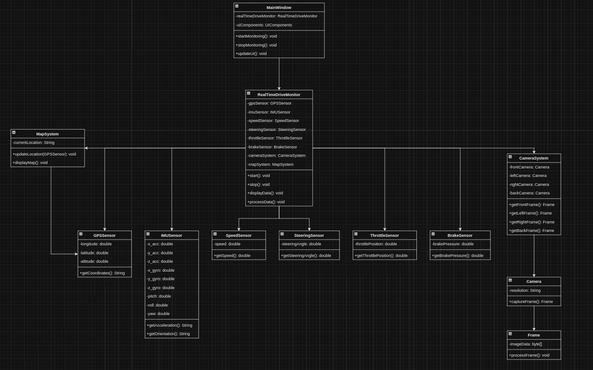

# RealTimeDriveMonitor
RealTimeDriveMonitor is a real-time monitoring system that provides a visual interface for displaying live camera feeds (front, left, right, back) from a vehicle along with sensor data such as GPS, IMU, speed, steering, throttle, and brake. The system integrates with Google Maps to show the vehicle's current location and ensures synchronized data display with camera frames.

## Features
The RealTimeDriveMonitor system integrates various vehicle sensors to provide real-time data along with visual camera feeds. The key sensors include:

- Real-Time Camera Feeds: Displays live video from four vehicle-mounted cameras (front, left, right, back), enabling comprehensive monitoring of the vehicle's surroundings.
- Synchronized Sensor Data: Displays relevant sensor data (speed, steering, GPS, etc.) alongside the camera feeds, all synchronized to the current timestamp of the video frames.
- Map Integration: Integrates Google Maps to display the vehicle's real-time location based on GPS data.
- Data Prioritization: Starts reading and displaying frames from the first available front camera frame, ensuring consistency in the visual feed.
- User-Friendly Interface: A clean and organized UI to easily monitor the vehicle’s environment and sensor data in real-time.

## System Input Sensors

### 1. Cameras (Left, Front, Right, Back):
- Each camera captures video frames showing the surrounding environment of the car from different perspectives.
- The system will show synchronized frames from all four cameras on the screen.
- The video frames must be timestamped to ensure synchronization across all camera feeds.

### 2. GPS (Global Positioning System)
- **Data**: Longitude, Latitude, Altitude: The GPS provides geographical coordinates (longitude and latitude) and altitude data. This data is used to determine the car's exact position on the Earth's surface.
- **Google Maps Integration**: The position data will be used to show the car's current location on a map. The map can be updated in real-time using Google Maps or any other mapping service API.

### 3. IMU (Inertial Measurement Unit)
The Inertial Measurement Unit provides the vehicle's current movement status to all requesting devices. IMU data helps track the car's movement and orientation in space. This data is crucial for understanding the vehicle's dynamics, especially during turns or rough terrains.

- **Accelerometer (x, y, z)**: Measures the car's acceleration in three dimensions.
- **Gyroscope (x, y, z)**: Measures the car's angular velocity or rotation in three dimensions.
- **Magnetometer (x, y, z)**: Measures the magnetic field, which helps determine the car's orientation relative to Earth's magnetic field.
    - **Orientation (pitch, roll, yaw)**:  These values represent the orientation of the vehicle in three-dimensional space
        - `Pitch`: Rotation around the x-axis (e.g., nose up or down).
        - `Roll`: Rotation around the y-axis (e.g., tilting side to side).
        - `Yaw`: Rotation around the z-axis (e.g., turning left or right).

### 4. Vehicle Telemetry
- **Speed**: The current speed of the vehicle, typically provided by the car's onboard systems.
- **Steering Angle**: The angle at which the steering wheel is turned, which helps understand the car's direction.
- **Throttle Position**: Indicates the degree to which the accelerator pedal is pressed, reflecting how much power the driver is requesting from the engine.
- **Brake Pressure**: Measures the pressure applied to the brake pedal, indicating the braking force being applied.

### 4. Speed Sensor
The speed sensor measures the vehicle’s current speed, providing real-time feedback to the system and the driver. Speed data is critical for monitoring compliance with speed limits, controlling cruise control systems, and assisting in various safety features like automatic braking.

### 5. Steering Angle Sensor
The steering angle sensor measures the angle of the steering wheel, indicating the direction the vehicle is moving or about to move. Its data used in lane-keeping assist, stability control systems, and automated driving features to ensure the vehicle follows the intended path.

### 6. Throttle Position Sensor
This sensor monitors the position of the throttle (the pedal that controls acceleration), indicating how much power the driver is demanding from the engine. Its data used for controlling engine power, cruise control systems, and optimizing fuel efficiency.

### 7. Brake Sensor
The brake sensor detects when and how hard the brake pedal is pressed, providing real-time information on braking actions. Its data essential for safety systems like ABS (Anti-lock Braking System), collision avoidance systems, and for general vehicle control during deceleration.

Class Diagram:

